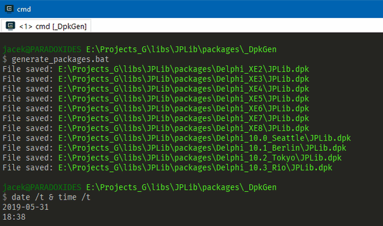

# DpkGen 

* [Overview](#overview)
* [Download](#download)
* [Usage](#usage)
	* [Input / Output options](#input--output-options)
	* [Information](#information)
	* [Exit codes](#exit-codes)
	* [Hints](#hints)
* [Template files](#template-files)
* [Example](#example)
* [Compilation](#compilation)
* [Changelog / Releases](#changelog--releases)
* [License](#license)
* [Note](#note)

---

## Overview

**DpkGen** is a very small command line utility which allows you to generate Delphi package files (DPK) based on the given template file.

## Download

Source: https://github.com/jackdp/DpkGen

Binary (Windows 32-bit/64-bit): http://www.pazera-software.com/products/dpk-generator/

---

## Usage

Usage: **DpkGen.exe** `-t=FILE -o=FILE [-d=STR] [-p=STR] [-s=STR] [-v=STR] [-h] [-V] [--home]`

Mandatory arguments to long options are mandatory for short options too.  
Options are **case-sensitive**. Options in square brackets are optional. Equality characters (`=`) are also optional.

### Input / Output options

**`-t`, `--template-file=FILE`**  
Template DPK file.

**`-o`, `--output-file=FILE`**  
The output DPK file.

**`-d`, `--description=STR`**  
Package description. All instances of the text `<DESCRIPTION>` in the template file will be replaced by the string specified in this option.

**`-p`, `--lib-prefix=STR`**  
Library prefix. All instances of the text `<LIBPREFIX>` in the template file will be replaced by the string specified in this option.

**`-s`, `--lib-suffix=STR`**  
Library suffix. All instances of the text `<LIBSUFFIX>` in the template file will be replaced by the string specified in this option.

**`-v`, `--lib-version=STR`**  
Library version. All instances of the text `<LIBVERSION>` in the template file will be replaced by the string specified in this option.

### Information

**`-h`, `--help`**  
Show help.

**`-V`, `--version`**  
Show application version.

**`--home`**  
Opens program homepage in the default browser.

### Exit codes

|Value  |Description      |
|:-----:|:----------------|
|0      | OK - no errors  |
|2      | Syntax error    |
|1      | Other error     |

### Hints
You can use relative paths when specifying an input template file and an output DPK file.
If the output directory does not exist, it will be created automatically.

---

## Template files

The template file should be a regular DPK package, with one exception - the following strings (placeholders) in the DPK file will be replaced by values passed from the command line to the **DpkGen** program:

|DPK string (placeholder)  |cmd-line option with sample value      |
|:-----:|:----------------|
| `<description>` | `-d "SomeLib - Runtime package"` |
| `<libprefix>` | `-p dcl` |
| `<libsuffix>` | `-s XE4`|
| `<libversion>` | `-v 1.1.0`|


```delphi
package SomeLib;
{$R *.res}
{$IFDEF IMPLICITBUILDING This IFDEF should not be used by users}
{$ALIGN 8}
{.....}
{$ENDIF IMPLICITBUILDING}
{$DESCRIPTION '<description>'}
{$LIBPREFIX '<libprefix>'}
{$LIBSUFFIX '<libsuffix>'}
{$LIBVERSION '<libversion>'}
{$RUNONLY}
requires
  rtl;
contains
  Unit1 in '..\..\Source\Unit1.pas';
end.
```

After launching the **DpkGen** with the parameters as in the above table, we will get:

```delphi
package SomeLib;
{$R *.res}
{$IFDEF IMPLICITBUILDING This IFDEF should not be used by users}
{$ALIGN 8}
{.....}
{$ENDIF IMPLICITBUILDING}
{$DESCRIPTION 'SomeLib - Runtime package'}
{$LIBPREFIX 'dcl'}
{$LIBSUFFIX 'XE4'}
{$LIBVERSION '1.1.0'}
{$RUNONLY}
requires
  rtl;
contains
  Unit1 in '..\..\Source\Unit1.pas';
end.
```

When you manage a collection of packages for many versions of Delphi, thanks to **DpkGen**, you can create one general template and quickly generate all necessary packages. You can use, for example, a batch file from the example below.

As you can see, the program is very simple (just ordinary `StringReplace`), but if you manage multiple packages from many libraries, **DpkGen** can save you a lot of time.

The program has a built-in advanced command line option parser, has a flexible structure and can be easily expanded with additional functions: simply register the command line option in the `RegisterOptions` procedure, read / check the option value in the `ProcessOptions` and perform the appropriate actions in the `CreateDpkFile`.

Of course, similar functionality can be achieved using more complex scripts or grep-like applications. Just choose the solution that you prefer.

---

## Example

This example shows how to generate DPK files for the Delphi version from XE2 to 10.3 Rio using the <b>DpkGen</b> program launched from a batch file:

```bat
@echo off

set Template=JPLib_TEMPLATE.dpk
set Desc="JPLib Runtime Package"
set BaseOutDir=..\Delphi
set ShortDpkName=JPLib.dpk

for %%x in (XE2,XE3,XE4,XE5,XE6,XE7,XE8) do (
  DpkGen -t %Template% -d %Desc% -o %BaseOutDir%_%%x\%ShortDpkName% -s %%x
)

DpkGen -t %Template% -d %Desc% -o %BaseOutDir%_10.0_Seattle\%ShortDpkName% -s Seattle
DpkGen -t %Template% -d %Desc% -o %BaseOutDir%_10.1_Berlin\%ShortDpkName% -s Berlin
DpkGen -t %Template% -d %Desc% -o %BaseOutDir%_10.2_Tokyo\%ShortDpkName% -s Tokyo
DpkGen -t %Template% -d %Desc% -o %BaseOutDir%_10.3_Rio\%ShortDpkName% -s Rio
```




---

## Compilation

> Tested on Lazarus 2.0.3 with Free Pascal Compiler 3.3.1

To compile, you need:
1. [Lazarus IDE](https://www.lazarus-ide.org/)
1. A several Pascal units from my library [JPLib](https://github.com/jackdp/JPLib/).
1. And of course, the source files from this repository.

How to build:
1. Open `src\DpkGen.lpi` file with the Lazarus IDE.
1. Set build mode.  
Select menu `Project -> Project Options...` A new window will appear.
In the tree view (on the left), select `Compiler Options`.
At the top of this window you can select the build mode from the dropdown list.
You can choose one of prepared build modes (`Release Win32`, `Release Win64`) or create your own.
1. Build project (menu `Run->Build`).

---

## Changelog / Releases

**Version 1.0** (2019.05.31)  
Initial release.

---

## License

Absolutely freeware: You can use / modify my source files and compiled binary files for any purpose, without any restrictions and without any fees.

---

## Note

This program was made for my private use, but it may also be useful to someone.

When once again I had to copy a dozen DPK files and manually correct the descriptions and lib suffixes in them, I said: "enough!" and I wrote this program.